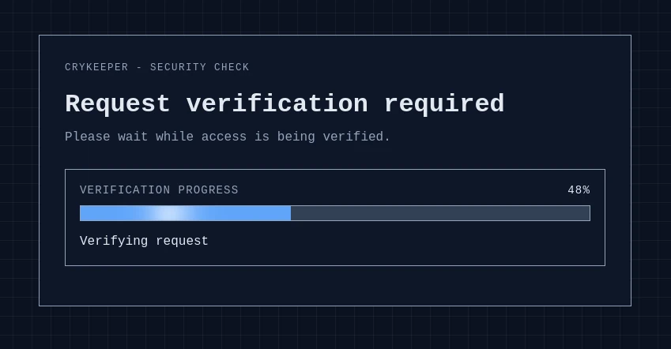
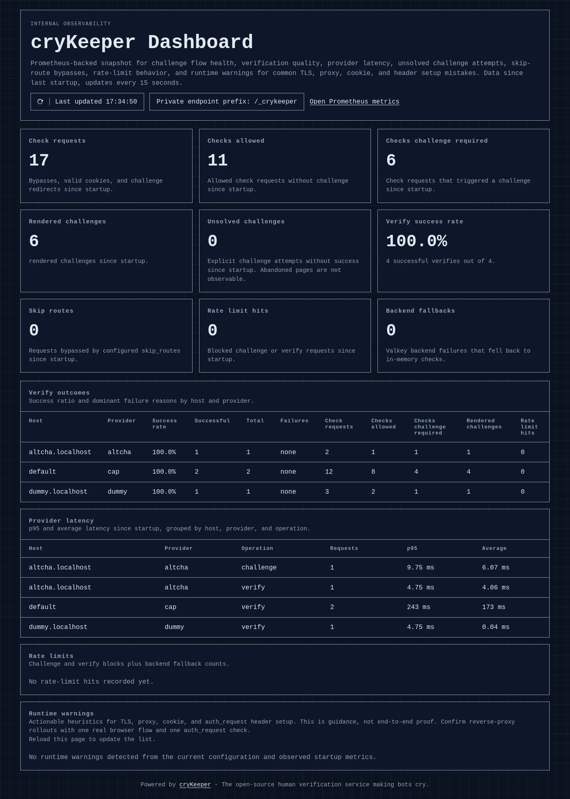

# 🛡️ cryKeeper

**The open-source human verification service for nginx making bots cry.**

[](https://opensource.org/licenses/MIT)
[](https://github.com/cryMG/cryKeeper/pkgs/container/crykeeper)

[](https://github.com/cryMG/cryKeeper/actions)

> [!NOTE]
> **cryKepper** is currently in early development.  
> Anything can change, and there are no guarantees about stability, security, or data integrity. Use with caution and always test thoroughly before deploying in production.

cryKeeper is a lightweight, Python-powered security container designed to protect your web applications from automated bots, scrapers, and credential stuffing. Utilizing nginx's native `auth_request` module, it intercepts malicious traffic before it ever touches your backend.

**Why cryKeeper?**

- **Open Source:** Fully transparent, with no hidden dependencies.
- **GDPR-Friendly:** No tracking, no third-party cookies, and a strong focus on user privacy.
- **Zero Backend Overhead:** Bots are rejected directly at the nginx level.
- **Docker-Ready:** Deploy in seconds via `docker-compose`.
- **Language Agnostic:** Works flawlessly whether your app is as static website or built in Node.js, PHP, Go, Python or any other language.





## ⚠️ Important Note: Good Bots vs. Bad Bots ⚠️

By default, **cryKeeper** focuses strictly on verifying human behavior. This means that *good bots* (like Googlebot, Bingbot, or uptime monitors) will also be blocked or challenged because they cannot pass human verification.

- *If your site relies on SEO (Google Indexing):* You can allow known search engines directly in cryKeeper, or bypass selected clients with explicit IP or User-Agent allowlists. Prefer IP-based allowlists when trust boundaries matter, because User-Agent matching is easy to spoof.
- *If your site is a private app (Nextcloud, Bitwarden, internal tools):* This is actually a feature! It keeps your private instances completely hidden from any search engine or automated scanner.

## Features

- Protect selected areas of a website behind nginx with a human verification step.
- Reuse signed stateless verification cookies so visitors do not need to solve a challenge on every request.
- Choose between Cap, ALTCHA, hCaptcha, or Dummy mode depending on your deployment and testing needs.
- Configure shared defaults and per-host website overrides with different domains, prefixes, and challenge settings.
- Roll out new cryKeeper rules with explicit enforcement modes, from pure logging, challenge passthrough to enforce.
- Exclude selected routes from checks with skip rules when parts of the site should stay reachable without verification.
- Bypass the human check for selected client IPs, User-Agent regexes, or a built-in set of common search-engine crawlers.
- Apply challenge and verify rate limits, with optional shared state through Valkey for multi-worker or multi-instance deployments.
- Localize the challenge page and add deployment-specific footer content.
- Internal Prometheus metrics and a dashboard for monitoring verify success rates, dominant failure reasons, provider latency, and rate-limit hits.

## How it works

- nginx sends an internal auth_request subrequest to cryKeeper before the original request reaches the protected upstream.
- cryKeeper first evaluates configured auth bypasses for routes, client IPs, User-Agents, and optional known search-engine crawlers. If one matches, cryKeeper returns 204 immediately.
- Otherwise cryKeeper checks the signed verification cookie. If it is valid, cryKeeper returns 204 and nginx forwards the original request to the website.
- If the cookie is missing or invalid, cryKeeper returns 401 together with an X-Auth-Redirect header so nginx can redirect to, or internally proxy, the challenge page.
- After a successful challenge, cryKeeper sets a new signed verification cookie and returns a minimal no-store completion page that sends the browser back to the validated original target without exposing URL fragments to the backend.

## Supported verification modes

cryKeeper supports four verification modes. They all use the same stateless cookie flow, but differ in external dependencies, operations, and user experience.

> [!TIP]
> *Cap* is the recommended mode for most production deployments and is the most tested option in this project.  
> Because Cap does significantly more than a simple CAPTCHA, it provides a better user experience and stronger bot protection than the other modes. It is also self-hosted, so you can run it in the same private network without mandatory third-party dependencies.

| Mode | External dependency | Typical use | Notes |
| --- | --- | --- | --- |
| **[Cap](https://trycap.dev/)** | Self-hosted Cap service | Production / privacy-focused setups | Best fit when you want strong protection without relying on third-party CAPTCHA providers. |
| **[ALTCHA](https://altcha.org/)** | None required (can run fully local) | Production / minimal dependencies | Proof-of-work challenge with server-side cryptographic verification. |
| **[hCaptcha](https://www.hcaptcha.com/)** | hCaptcha SaaS API | Production with managed provider | Requires site/secret keys and outbound internet access from cryKeeper to hCaptcha endpoints. |
| **Dummy** | None | Local development and wiring tests | No real bot protection. Never use in production. |

Detailed differences:

- **Cap** mode performs real verification against a configured Cap instance.
  - Cap is a privacy-focused self-hosted CAPTCHA service for the modern web.
  - Requires running and operating Cap, but avoids mandatory third-party dependencies in production.
- **ALTCHA** mode serves the ALTCHA widget and verifies its signed proof-of-work payload server-side.
  - Can be fully self-contained and stateless, especially with the bundled local ALTCHA script.
- **hCaptcha** mode uses hCaptcha's browser widget plus server-side validation against hCaptcha's siteverify API.
  - Best when you prefer a managed provider over operating your own CAPTCHA backend.
- **Dummy** mode simulates verification without a real provider.
  - Useful for local integration tests, demos, and CI wiring only.

## Installation

The recommended installation path is Docker Compose with the published GHCR image `ghcr.io/crymg/crykeeper:latest`.

Alternatively you may use a version tag such as `:v1.2.3` or `:v1.2` or `:v1`, or the `nightly` tag for the latest build from the default branch.

Requirements:

- Docker
- Docker Compose
- nginx or another reverse proxy that can call cryKeeper's check endpoint

Quick start with the latest published image:

1. Create a working directory and place your cryKeeper configuration there as `config.toml`. You can start from [config.example.toml](config.example.toml).
2. Create a `docker-compose.yml` like this:

```yaml
services:
  crykeeper:
    image: ghcr.io/crymg/crykeeper:latest
    ports:
      - "127.0.0.1:5000:5000"
    volumes:
      - ./config.toml:/app/config.toml:ro
    restart: unless-stopped
```

1. Pull and start the service:

```bash
docker compose pull
docker compose up -d
```

This starts a minimal production-like cryKeeper service from the published image and binds it only on `127.0.0.1:5000` so a local nginx or another trusted reverse proxy can reach it without exposing cryKeeper itself publicly. The container reads `/app/config.toml` by default.
The Docker image runs the Gunicorn process as a dedicated unprivileged `crykeeper` user, so mounted config files should stay readable inside the container.

If your nginx runs in the same Docker network, prefer an internal container-to-container connection and replace the localhost port binding with `expose:` or an equivalent private network setup.

If you want to build cryKeeper from the local source tree instead, use the checked-in [docker-compose.yml](docker-compose.yml). The source-based local demo flow is documented below in [Local Demo Stack](README.md#local-demo-stack).

The Docker image starts Gunicorn with 2 workers and 4 threads by default. You can override that with `CRYKEEPER_GUNICORN_WORKERS` and `CRYKEEPER_GUNICORN_THREADS`.

For the internal Prometheus endpoint and dashboard, the Docker image also enables Prometheus multiprocess mode by default through `CRYKEEPER_PROMETHEUS_MULTIPROC_DIR=/tmp/crykeeper-prometheus`. If you override that path, keep it writable for the container user and let startup clear it before Gunicorn forks workers.

These runtime variables affect only the container startup and internal Prometheus worker aggregation. They are separate from the cryKeeper application settings and are not part of the TOML and `CRYKEEPER_*` config precedence described below.

### Available Docker Images

Docker images are published to `ghcr.io/crymg/crykeeper`.
Published tags are multi-architecture manifests for `linux/amd64` and `linux/arm64`.

The `latest` tag always points to the most recent stable release, which is a Git tag in the form `vX.Y.Z` without any pre-release suffix. The `nightly` tag points to the latest build from the default branch that does not carry a version tag.

You may also pull specific version tags such as `v1.2.3`, `v1.2`, or `v1` to get a specific release or the latest patch release in a minor or major series.

## Reverse Proxy Integration

cryKeeper is intended to be called by nginx via `auth_request`. A minimal setup looks like this:

```nginx
upstream crykeeper_app {
  server crykeeper:5000;
}

upstream protected_app {
  server app:8080;
}

location = /_crykeeper_check {
  internal;
  proxy_pass http://crykeeper_app/crykeeper/check;
  proxy_pass_request_body off;
  proxy_set_header Content-Length "";
  proxy_set_header Cookie $http_cookie;
  proxy_set_header Host $http_host;
  proxy_set_header User-Agent $http_user_agent;
  proxy_set_header X-Forwarded-For $remote_addr;
  proxy_set_header X-Forwarded-Proto $scheme;
  proxy_set_header X-Original-Method $request_method;
  proxy_set_header X-Original-URI $request_uri;
  # Forward the dedicated bypass token header if you use bypass_headers.
  proxy_set_header X-CryKeeper-Token $http_x_crykeeper_token;
}

location @crykeeper_challenge {
  proxy_pass http://crykeeper_app$auth_redirect;
  proxy_set_header Cookie $http_cookie;
  proxy_set_header Host $http_host;
  proxy_set_header X-Forwarded-Host $http_host;
  proxy_set_header X-Forwarded-Proto $scheme;
  proxy_set_header X-Forwarded-For $remote_addr;
}

location /protected/ {
  auth_request /_crykeeper_check;
  auth_request_set $auth_redirect $upstream_http_x_auth_redirect;
  error_page 401 =403 @crykeeper_challenge;
  proxy_pass http://protected_app;
}

location ^~ /crykeeper/ {
  proxy_pass http://crykeeper_app;
  proxy_set_header Host $http_host;
  proxy_set_header X-Forwarded-Proto $scheme;
  proxy_set_header X-Forwarded-For $remote_addr;
}
```

When nginx terminates HTTPS before forwarding to cryKeeper over HTTP, set `trusted_proxy_hops` to the number of trusted proxy hops and set `trusted_proxy_cidrs` to the nginx network ranges. cryKeeper aborts startup when proxy hops are enabled without trusted proxy CIDRs, because that would trust forwarded headers from any direct peer.

Keep the public prefix in nginx aligned with your configured `path_prefix`. If you use per-host `[[website]]` overrides, each host must forward to the matching cryKeeper prefix.
The example above internally proxies the challenge page so the browser keeps the original protected URL visible while still receiving `403 Forbidden`. If you prefer a visible jump to the cryKeeper path instead, you can replace the named location body with `return 302 $auth_redirect;` and change the `error_page` line back to `error_page 401 = @crykeeper_challenge;`.
That internal-proxy pattern is also what lets cryKeeper preserve client-side URL fragments after verification without sending them to the backend. A visible redirect to `<path_prefix>/challenge` loses the fragment before the challenge page can store it.

## Endpoint Overview

Every configured `path_prefix` exposes the same set of cryKeeper endpoints. With the default configuration, the paths are available below `/crykeeper`.

- `GET <path_prefix>/check`: internal auth endpoint for nginx `auth_request`. Returns `204 No Content` when a configured bypass matches or when the signed verification cookie is valid, or `401 Unauthorized` plus the `X-Auth-Redirect` header when nginx should hand the browser over to the challenge flow, for example by internally proxying the challenge page with a `403 Forbidden` response. In `log_only`, cryKeeper logs those would-challenge decisions but returns `204 No Content` instead. In `challenge_passthrough`, it also accepts a signed passthrough cookie created after a failed verification while that mode remains active.
- `GET <path_prefix>/challenge`: browser-facing challenge page. Renders the configured verification flow, respects the safe local `return` query parameter, enforces the secure-transport rules, and applies the challenge rate limit.
- `POST <path_prefix>/verify`: completes the active provider verification, sets the signed verification cookie, and returns a small no-store HTML completion page that continues the browser to the validated local `return` path. That final browser-side hop keeps URL fragments client-side when the challenge itself was shown without leaving the original protected URL. This endpoint is protected by the verify rate limit. In `challenge_passthrough`, failed verifies return the same completion page with a signed passthrough cookie instead of blocking access.
- `GET <path_prefix>/altcha/challenge`: provider-specific ALTCHA challenge endpoint. Returns a fresh signed ALTCHA challenge as JSON and applies the same secure-transport and challenge rate-limit checks as the HTML challenge page.
- `GET <path_prefix>/clear`: removes the verification cookie and redirects to the validated local `return` path, falling back to `/` if the parameter is missing or invalid.
- `GET <path_prefix>/healthz`: minimal liveness endpoint for container and reverse-proxy health checks. Returns `200 OK` with the body `ok`.
- `GET <path_prefix>/static/*`: static assets for the challenge page and verification flows, including the bundled vendor files. In the published Docker image, cryKeeper build-minifies its local JS and CSS entry assets into content-hashed filenames and resolves them through an internal manifest at render time; those manifest-backed hashed assets are served with a public 14-day cache header, while source checkouts without that manifest keep serving the plain source filenames.

In deployments with `[[website]]` overrides, the same endpoint set is also exposed below each additional configured `path_prefix`.

## Internal Observability

cryKeeper also exposes two fixed internal observability endpoints outside the public `path_prefix` namespace:

- `GET /_crykeeper/metrics`: Prometheus exposition endpoint with counters and histograms for auth checks, challenge renders, explicit unsolved challenge attempts, verify outcomes, rate-limit hits, provider latency, and rate-limit backend fallbacks.
- `GET /_crykeeper/dashboard`: small server-rendered dashboard built from the same live Prometheus metrics. It shows verify success rates, explicit unsolved challenge attempts, dominant failure reasons, provider latency, skip-route bypass counts, rate-limit hits, backend fallback counts, and runtime warnings for common TLS, proxy, cookie, and auth_request header misconfiguration.

These endpoints are meant for private reverse-proxy exposure only, for example on a dedicated internal hostname or an allowlisted admin vhost. They are intentionally not registered below `path_prefix`, so the normal public challenge routes do not expose them automatically.

The dashboards runtime warnings section is intentionally heuristic. It can flag local configuration risks and runtime symptoms such as insecure-transport rejections or missing proxy/auth_request headers like `Host`, `User-Agent`, `X-Forwarded-For`, `X-Forwarded-Proto`, and `X-Original-*`, but it does not replace one real browser test through your reverse proxy.

If you run multiple Gunicorn workers, keep Prometheus multiprocess mode enabled so the metrics endpoint aggregates all workers correctly. The bundled Docker image handles this automatically with `CRYKEEPER_PROMETHEUS_MULTIPROC_DIR`.

## Configuration

Preferred configuration is TOML. Environment variables are supported as an alternative.

Configuration precedence:

1. Built-in defaults
2. Shared `[crykeeper]` values from the TOML file
3. Non-empty `CRYKEEPER_*` environment variables
4. A matching `[[website]]` TOML block for the current host

Use TOML for the main configuration:

- Shared defaults go into `[crykeeper]`
- Optional per-host overrides go into `[[website]]`
- The default config path inside the container is `/app/config.toml`
- `path_prefix` must not equal `/_crykeeper`, because that fixed prefix is reserved for the internal observability endpoints

Minimal example:

```toml
[crykeeper]
secret_key = "change-me-in-production"
verification_mode = "dummy"
enforcement_mode = "enforce"
path_prefix = "/crykeeper"
human_cookie_secure = true
trusted_proxy_hops = 1
trusted_proxy_cidrs = ["172.16.0.0/12"]
cap_public_base_url = "https://cap.example.com"
cap_site_key = "your-cap-site-key"
cap_secret_key = "your-cap-secret-key"

[[website]]
domains = ["one.example.com"]
path_prefix = "/one-check"
```

cryKeeper refuses to start while `secret_key` still uses the published placeholder value.
The example above assumes one trusted nginx hop in a Docker-style private network. If your reverse proxy uses a different source range or multiple hops, adjust `trusted_proxy_hops` and `trusted_proxy_cidrs` accordingly.

Start from [config.example.toml](config.example.toml) for the full TOML structure.

If you prefer environment variables, use the names documented in [.env.example](.env.example). Example:

```bash
export CRYKEEPER_SECRET_KEY=change-me-in-production
export CRYKEEPER_VERIFICATION_MODE=dummy
export CRYKEEPER_PATH_PREFIX=/crykeeper
export CRYKEEPER_TRUSTED_PROXY_HOPS=1
export CRYKEEPER_TRUSTED_PROXY_CIDRS=172.16.0.0/12
```

Non-empty environment variables override only the shared defaults. They do not create or override individual `[[website]]` entries.

### Secret Key Rotation

To rotate the cookie signing key, set a new `secret_key` and keep the retired value in `previous_secret_keys` or `CRYKEEPER_PREVIOUS_SECRET_KEYS` for as long as old cookies may still exist. New cookies are always signed with `secret_key`; the previous keys are verify-only. Remove retired keys after at least the longest effective `human_cookie_ttl_seconds` has elapsed.

### Logging Privacy

Anonymized client-IP logging is enabled by default. Keep `anonymize_client_ip_logs = true` or `CRYKEEPER_ANONYMIZE_CLIENT_IP_LOGS=true` when cryKeeper's own application logs must not contain full client IPs. When enabled, the `client_ip` log field is reduced to an anonymized network prefix such as `203.0.113.0/24` or `2001:db8:abcd::/48`.

This is a shared setting and must be configured under `[crykeeper]` or via `CRYKEEPER_ANONYMIZE_CLIENT_IP_LOGS`; `[[website]]` entries do not override it. This changes only cryKeeper application logs. The full sanitized client IP is still used in-memory for `human_cookie_binding = "ip-user-agent"`, `bypass_ips`, rate limiting, and provider verification where required. The signed cookie itself never stores the raw IP or raw `User-Agent`; it stores only an HMAC digest of the computed client binding. The bundled Docker image's Gunicorn access logs include the same anonymized client-IP value through the custom logger in `gunicorn.conf.py`. External reverse-proxy or platform logs are still separate and may record full client IPs unless you configure them independently.

### Custom Footer

`footer_html` is optional. If you leave it unset, the challenge page shows the built-in cryKeeper footer by default. Set it to a custom trusted HTML string or a locale-keyed table to override that default per host. Set it to `-` to hide the challenge footer entirely. The internal dashboard always shows the built-in default footer.

### Enforcement Modes

Use `enforcement_mode` when you want to choose between normal enforcement and safer rollout behavior.

- `enforce`: default production behavior.
- `log_only`: validate new prefixes, bypasses, or proxy rules against live traffic without showing the challenge or blocking users.
- `challenge_passthrough`: still show the real challenge flow, but let failed verifies continue with a signed passthrough cookie instead of locking users out.

```toml
[crykeeper]
enforcement_mode = "log_only"
```

```bash
export CRYKEEPER_ENFORCEMENT_MODE=log_only
```

With `enforcement_mode = "log_only"`, cryKeeper still evaluates bypass rules, cookies, and return-path handling during `GET <path_prefix>/check`, and logs every request that would have been challenged. The difference is only in enforcement: cryKeeper returns `204 No Content` instead of `401 Unauthorized`, so nginx continues to the protected upstream.

With `enforcement_mode = "challenge_passthrough"`, cryKeeper still shows the normal challenge. If `POST <path_prefix>/verify` fails, cryKeeper records the failed verification outcome but returns the same completion page with a signed passthrough cookie instead of blocking access. That passthrough cookie is not a real human-verification cookie and is ignored again as soon as you switch back to `enforce` or `log_only`.

This is intended for safe live rollouts of new prefixes, bypasses, proxy handling, and challenge UX changes. Only a real successful verification creates the normal human-verification cookie.

### Optional verification bypasses

Requests that match any of the following settings are allowed through `GET <path_prefix>/check` immediately and do not need a valid verification cookie:

- `skip_routes`: bypasses based on the original request path and optional HTTP method.
- `bypass_headers`: exact header/value pairs matched against the current request headers. This is suitable for automation clients that can send a dedicated token header themselves. Token values must be at least 32 characters long.
- `bypass_user_agents`: Python regexes matched against the current `User-Agent` header.
- `bypass_ips`: client IPs or CIDR ranges matched against the sanitized client address after trusted proxy handling.
- `allow_known_search_engines`: enables a built-in `User-Agent` matcher for common search crawlers such as Googlebot, Bingbot, DuckDuckBot, Yahoo Slurp, YandexBot, Baiduspider, Applebot, PetalBot, and SeznamBot.

TOML example:

```toml
[crykeeper]
bypass_headers = [
  "X-CryKeeper-Token=0123456789abcdef0123456789abcdef", "X-CryKeeper-Token=fedcba9876543210fedcba9876543210",
]
bypass_user_agents = ["^MyMonitoringBot/", "(?i)uptimerobot"]
bypass_ips = ["203.0.113.10", "2001:db8::/32"]
allow_known_search_engines = true
```

Environment variable example:

```bash
export CRYKEEPER_BYPASS_HEADERS='X-CryKeeper-Token=0123456789abcdef0123456789abcdef,X-CryKeeper-Token=fedcba9876543210fedcba9876543210'
export CRYKEEPER_BYPASS_USER_AGENTS='^MyMonitoringBot/,(?i)uptimerobot'
export CRYKEEPER_BYPASS_IPS='203.0.113.10,2001:db8::/32'
export CRYKEEPER_ALLOW_KNOWN_SEARCH_ENGINES=true
```

Use `bypass_ips` when you want the strongest built-in trust signal. `bypass_headers` works well for scripts, CI jobs, uptime checks, or other automation clients that can attach a long random token such as `X-CryKeeper-Token: ...` themselves. Tokens must be at least 32 characters long. Treat them as bearer secrets, not as trustworthy identity claims: anyone who knows a token can bypass the check, so keep tokens random, rotate them when needed, and use them only over HTTPS. If your public edge injects, strips, or rewrites that header, keep that behavior deliberate and consistent. `bypass_user_agents` and `allow_known_search_engines` are convenient, but both ultimately rely on a client-controlled header.

> [!NOTE]
> When nginx sits in front of cryKeeper, remember that the auth subrequest only sees the headers that nginx forwards into `auth_request`. If you expect `bypass_headers` to match, explicitly mirror the chosen token header such as `X-CryKeeper-Token` into the `/check` subrequest.

## When Valkey Makes Sense

cryKeeper stays stateless even when you enable Valkey. The only thing stored in Valkey is rate-limit state; the human-verification cookie remains signed and client-side.

Use the default in-memory rate limiter when you run a single cryKeeper process or a small deployment where per-process limits are acceptable.

Use Valkey when you need shared and consistent rate limits across multiple cryKeeper workers, containers, or hosts. It is especially useful when:

- traffic is distributed across multiple cryKeeper replicas behind a load balancer
- you run multiple worker processes and want one common challenge or verify budget instead of separate budgets per worker
- rate limits should remain effective across process restarts instead of resetting with in-memory state

This also applies to the bundled Docker image: it starts Gunicorn with 2 workers by default unless you override `CRYKEEPER_GUNICORN_WORKERS`, so Valkey should be configured when you deploy the image with multiple workers and want consistent effective rate limits.

In practice, `rate_limit_backend = "auto"` plus a configured `rate_limit_valkey_url` is the simplest production setup when you need distributed rate limiting.

## Production Checklist

- Set a long random value for `secret_key` or `CRYKEEPER_SECRET_KEY`; cryKeeper refuses to start with the published placeholder default
- When rotating `secret_key`, keep retired values in `previous_secret_keys` or `CRYKEEPER_PREVIOUS_SECRET_KEYS` until the longest active cookie TTL has elapsed, then remove them
- Serve cryKeeper behind HTTPS and set `human_cookie_secure = true` in production
- Keep `enforcement_mode = "enforce"` outside planned validation windows, because both rollout modes intentionally allow access that would otherwise be challenged
- Keep the reverse proxy prefix aligned with `path_prefix`
- Set `trusted_proxy_hops` and `trusted_proxy_cidrs` to match your real proxy chain whenever a reverse proxy supplies forwarded headers
- Leave `anonymize_client_ip_logs` enabled unless you explicitly need full client IP addresses in cryKeeper's own application logs, and configure your reverse-proxy logs separately if they have the same requirement
- Decide explicitly whether trusted crawlers, monitoring systems, or upstreams should bypass the human check via `bypass_ips`, `bypass_headers`, `bypass_user_agents`, or `allow_known_search_engines`
- If you enable `bypass_headers`, use long random tokens with at least 32 characters over HTTPS and keep any proxy-side stripping, forwarding, or injection deliberate and consistent
- If you run multiple cryKeeper workers or replicas, configure Valkey for shared rate limiting via `rate_limit_backend` and `rate_limit_valkey_url`; this includes the default Docker image, which starts Gunicorn with 2 workers
- Expose `/_crykeeper/metrics` and `/_crykeeper/dashboard` only through a dedicated protected host, VPN, or other internal-only reverse-proxy path
- In Cap mode, set `cap_public_base_url`, `cap_site_key`, and `cap_secret_key`, plus `cap_internal_base_url` if server-side verification should use a different route
- In hCaptcha mode, set `hcaptcha_site_key` and `hcaptcha_secret_key`; `hcaptcha_script_url` and `hcaptcha_verify_url` default to the official endpoints
- In ALTCHA mode, set at least `altcha_hmac_secret`; `altcha_hmac_key_secret` is optional and `altcha_script_url` defaults to the cryKeeper-hosted bundled ALTCHA v3 widget with `PBKDF2/SHA-256` as the default challenge algorithm
- Mount your TOML configuration read-only in containers, or manage env-vars explicitly

## Healthcheck

cryKeeper exposes a health endpoint at `<path_prefix>/healthz`.

Examples:

- Default path prefix: `/crykeeper/healthz`
- Minimal cryKeeper-only example from the installation snippet: `http://127.0.0.1:5000/crykeeper/healthz`
- Checked-in local example stack: `https://localhost:8443/crykeeper/healthz`

If you override `path_prefix`, the healthcheck path changes with it.

## i18n

cryKeeper selects the UI language from the browser's `Accept-Language` header.

To adjust existing languages:

- Edit the JSON files in [app/i18n](app/i18n)
- Keep [app/i18n/en.json](app/i18n/en.json) complete, because English is the required fallback catalog
- Additional language files may be partial; missing keys fall back to English

To add a new language, add a new JSON file such as `fr.json` with translated keys.

If you run cryKeeper in Docker, you can also mount custom translation files into `/app/app/i18n/`, for example:

```yaml
services:
  crykeeper:
    volumes:
      - ./translations/fr.json:/app/app/i18n/fr.json:ro
```

Translation catalogs are discovered at startup, so restart the container after adding or changing language files.

## Local Demo Stack

For local end-to-end testing, use the checked-in [docker-compose.yml](docker-compose.yml). It builds cryKeeper from the current source tree and starts nginx, the demo backend, a local CAP container, and Valkey.

*Note:* Check the `config.toml` file after copying it from the example. The example configuration uses placeholder Cap keys, which are not valid for a real Cap instance. You need to replace them with real keys from your local Cap deployment for the demo to work as intended. Also you need to enable the hCaptcha test keys as described in the config if you want to test the hCaptcha demo.

```bash
cp config.example.toml config.toml
# optional: cp .env.example .env
mkdir -p nginx/certs
openssl req -x509 -nodes -days 365 -newkey rsa:2048 \
  -keyout nginx/certs/demo.key \
  -out nginx/certs/demo.crt \
  -config nginx/demo-cert.cnf
docker compose up --build
```

Then open:

- `https://localhost:8443/cap/`

The first browser visit will show a certificate warning because the demo uses a self-signed certificate. Accept it once for local testing.

Use the `CRYKEEPER_CAP_ADMIN_KEY` provided in your `.env` file if you want a custom local Cap admin key; otherwise the example stack uses the documented demo placeholder. Then log into the Cap admin interface and create a site. Enter the site key as `cap_site_key` and the secret key as `cap_secret_key` to your `config.toml`.

Then restart the cryKeeper container (or the whole stack) so it picks up the new Cap configuration:

```bash
docker compose restart crykeeper
```

The checked-in demo config keeps the Cap demos on localhost and cap.localhost, adds a fully protected Dummy host, keeps the dedicated provider-specific hosts for Dummy, ALTCHA, and hCaptcha, and exposes the internal dashboard on a separate demo hostname:

- `https://localhost:8443/protected/` uses Cap through the local `/cap` service
- `https://cap.localhost:8443/protected/` uses Cap through `/cap-check`
- `https://full.localhost:8443/` uses Dummy mode through `/full-check` and protects every backend path
- `https://dummy.localhost:8443/protected/` uses Dummy mode through `/dummy-check`
- `https://altcha.localhost:8443/protected/` uses ALTCHA with challenges generated by the cryKeeper itself
- `https://hcaptcha.localhost:8443/protected/` uses hCaptcha with the public test keys and therefore requires internet access
- `https://dashboard.localhost:8443/` serves the internal observability dashboard and `https://dashboard.localhost:8443/metrics` exposes the aggregated Prometheus metrics

Then open:

- `https://localhost:8443/`
- `https://full.localhost:8443/`
- `https://cap.localhost:8443/protected/`
- `https://dummy.localhost:8443/protected/`
- `https://altcha.localhost:8443/protected/`
- `https://hcaptcha.localhost:8443/protected/`
- `https://dashboard.localhost:8443/`
- `https://localhost:8443/protected/skip-route/`

### Benchmark using Local Demo Stack

The repository also includes [scripts/benchmark_auth_request.py](scripts/benchmark_auth_request.py) for a rough local comparison of nginx response latency with and without the `auth_request` path. It targets the running demo stack on `dummy.localhost` by default and measures:

- a direct unprotected backend response
- a protected response that falls through to the challenge page
- a protected response with a real verification cookie minted through Dummy mode
- a protected `skip_routes` hit
- an optional protected header-bypass hit when your local config defines `X-CryKeeper-Token=...`

Example:

```bash
python scripts/benchmark_auth_request.py --requests 400 --concurrency 20
```

If you also want the header-bypass scenario, add one of the documented bypass tokens to your local `config.toml`, restart cryKeeper, and rerun the benchmark. The checked-in demo nginx already mirrors `X-CryKeeper-Token` into the auth subrequest so those scenarios are measurable end to end.

## Troubleshooting

- Challenge redirects usually fail when nginx and cryKeeper do not use the same `path_prefix`
- Repeated challenges after a successful solve usually point to cookie, HTTPS, host, or proxy-header mismatches
- If `ip-user-agent` binding is unstable, verify `trusted_proxy_hops`, optional `trusted_proxy_cidrs`, and your forwarded-header setup
- If a custom translation does not appear, check the JSON filename, keep English complete, and restart the container after adding or changing files
- If `skip_routes` does not bypass the challenge, verify the regex against the original request path and make sure nginx forwards `X-Original-Method`
- If `bypass_headers` does not match as expected, verify the exact header name and value plus whether your reverse proxy strips, forwards, or injects that header as intended
- If `bypass_ips` does not match as expected, verify `trusted_proxy_hops`, `trusted_proxy_cidrs`, and which client IP cryKeeper actually sees after proxy sanitization

## License

### MIT License

Copyright (c) 2026 cryeffect Media Group <https://crymg.de>, Peter Müller <peter@crycode.de>

See [LICENSE](LICENSE) for the full license text.

### AI Usage Notice

AI was used as an assistive tool for parts of the code, tests and documentation.
The project idea, architecture, implementation decisions, testing, review and release responsibility were carried out by the maintainers before anything was committed.

### Bundled Third-Party Asset

cryKeeper vendors the ALTCHA browser bundle at `app/static/vendor/altcha.min.js` so ALTCHA mode works without a mandatory external CDN dependency.

The Docker image also runs a Python-only asset build step that minifies cryKeeper's own local JS and CSS entry files into hashed filenames plus `asset-manifest.json`. Flask uses that manifest when it is present, while repo-local source runs keep a no-manifest fallback to the original filenames. The checked-in demo nginx config also enables gzip for compressible responses.

- Upstream project: [ALTCHA](https://github.com/altcha-org/altcha)
- Bundled artifact: file `dist/main/altcha.min.js`
- Upstream license: MIT

When updating the bundled file, replace it from a reviewed ALTCHA release, prefer a pinned source URL such as `https://cdn.jsdelivr.net/npm/altcha@<version>/dist/main/altcha.min.js`, and rerun the focused ALTCHA tests afterwards.
