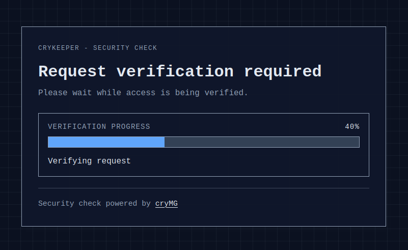

# 🛡️ cryKeeper

**The open-source human verification service for Nginx making bots cry.**

cryKeeper is a lightweight, Python-powered security container designed to protect your web applications from automated bots, scrapers, and credential stuffing. Utilizing Nginx's native `auth_request` module, it intercepts malicious traffic before it ever touches your backend.

**Why cryKeeper?**

- Open Source: Fully transparent, with no hidden dependencies.
- Zero Backend Overhead: Bots are rejected directly at the Nginx level.
- Docker-Ready: Deploy in seconds via `docker-compose`.
- Language Agnostic: Works flawlessly whether your app is as static website or built in Node.js, PHP, Go, Python or any other language.



## ⚠️ Important Note: Good Bots vs. Bad Bots ⚠️

By default, **cryKeeper** focuses strictly on verifying human behavior. This means that *good bots* (like Googlebot, Bingbot, or uptime monitors) will also be blocked or challenged because they cannot pass human verification.

- *If your site relies on SEO (Google Indexing):* You should whitelist known search engine IP ranges or user agents in your Nginx configuration before the request hits cryKeeper.
- *If your site is a private app (Nextcloud, Bitwarden, internal tools):* This is actually a feature! It keeps your private instances completely hidden from any search engine or automated scanner.

## Features

- Protect selected areas of a website behind nginx with a human verification step.
- Reuse signed stateless verification cookies so visitors do not need to solve a challenge on every request.
- Choose between Cap, ALTCHA, hCaptcha, or Dummy mode depending on your deployment and testing needs.
- Configure shared defaults and per-host website overrides with different domains, prefixes, and challenge settings.
- Exclude selected routes from checks with skip rules when parts of the site should stay reachable without verification.
- Apply challenge and verify rate limits, with optional shared state through Valkey for multi-worker or multi-instance deployments.
- Localize the challenge page and add deployment-specific footer content.

## How it works

- nginx sends an internal auth_request subrequest to cryKeeper before the original request reaches the protected upstream.
- cryKeeper checks the signed verification cookie. If it is valid, cryKeeper returns 204 and nginx forwards the original request to the website.
- If the cookie is missing or invalid, cryKeeper returns 401 together with an X-Auth-Redirect header so nginx can redirect to, or internally proxy, the challenge page.
- After a successful challenge, cryKeeper sets a new signed verification cookie and redirects the browser back to the validated original target.

## Supported verification modes

cryKeeper supports four verification modes. They all use the same stateless cookie flow, but differ in external dependencies, operations, and user experience.

*Cap* is the recommended mode for most production deployments and is the most tested option in this repository.

| Mode | External dependency | Typical use | Notes |
| --- | --- | --- | --- |
| **[Cap](https://trycap.dev/)** | Self-hosted Cap service | Production / privacy-focused setups | Best fit when you want strong protection without relying on third-party CAPTCHA providers. |
| **[ALTCHA](https://altcha.org/)** | None required (can run fully local) | Production / minimal dependencies | Proof-of-work challenge with server-side cryptographic verification. |
| **[hCaptcha](https://www.hcaptcha.com/)** | hCaptcha SaaS API | Production with managed provider | Requires site/secret keys and outbound internet access from cryKeeper to hCaptcha endpoints. |
| **Dummy** | None | Local development and wiring tests | No real bot protection. Never use in production. |

Detailed differences:

- **Cap** mode performs real verification against a configured Cap instance.
  - Cap is a privacy-focused self-hosted CAPTCHA service for the modern web.
  - Requires running and operating Cap, but avoids mandatory third-party dependencies in production.
- **ALTCHA** mode serves the ALTCHA widget and verifies its signed proof-of-work payload server-side.
  - Can be fully self-contained and stateless, especially with the bundled local ALTCHA script.
- **hCaptcha** mode uses hCaptcha's browser widget plus server-side validation against hCaptcha's siteverify API.
  - Best when you prefer a managed provider over operating your own CAPTCHA backend.
- **Dummy** mode simulates verification without a real provider.
  - Useful for local integration tests, demos, and CI wiring only.

## Installation

The recommended installation path is Docker Compose with the published GHCR image `ghcr.io/crymg/crykeeper:latest`.

Alternatively you may use a version tag such as `:v1.2.3` or `:v1.2` or `:v1`, or the `nightly` tag for the latest build from the default branch.

Requirements:

- Docker
- Docker Compose
- nginx or another reverse proxy that can call cryKeeper's check endpoint

Quick start with the latest published image:

1. Create a working directory and place your cryKeeper configuration there as `config.toml`. You can start from [config.example.toml](config.example.toml).
2. Create a `docker-compose.yml` like this:

```yaml
services:
  crykeeper:
    image: ghcr.io/crymg/crykeeper:latest
    ports:
      - "127.0.0.1:5000:5000"
    volumes:
      - ./config.toml:/app/config.toml:ro
    restart: unless-stopped
```

1. Pull and start the service:

```bash
docker compose pull
docker compose up -d
```

This starts a minimal production-like cryKeeper service from the published image and binds it only on `127.0.0.1:5000` so a local nginx or another trusted reverse proxy can reach it without exposing cryKeeper itself publicly. The container reads `/app/config.toml` by default.
The Docker image runs the Gunicorn process as a dedicated unprivileged `crykeeper` user, so mounted config files should stay readable inside the container.

If your nginx runs in the same Docker network, prefer an internal container-to-container connection and replace the localhost port binding with `expose:` or an equivalent private network setup.

If you want to build cryKeeper from the local source tree instead, use the checked-in [docker-compose.yml](docker-compose.yml). The source-based local demo flow is documented below in [Local Demo Stack](README.md#local-demo-stack).

The Docker image starts Gunicorn with 2 workers and 4 threads by default. You can override that with `CRYKEEPER_GUNICORN_WORKERS` and `CRYKEEPER_GUNICORN_THREADS`.

These two variables affect only the container's Gunicorn process. They are separate from the cryKeeper application settings and are not part of the TOML and `CRYKEEPER_*` config precedence described below.

## Reverse Proxy Integration

cryKeeper is intended to be called by nginx via `auth_request`. A minimal setup looks like this:

```nginx
upstream crykeeper_app {
  server crykeeper:5000;
}

upstream protected_app {
  server app:8080;
}

location = /_crykeeper_check {
  internal;
  proxy_pass http://crykeeper_app/crykeeper/check;
  proxy_pass_request_body off;
  proxy_set_header Content-Length "";
  proxy_set_header Cookie $http_cookie;
  proxy_set_header Host $http_host;
  proxy_set_header User-Agent $http_user_agent;
  proxy_set_header X-Forwarded-For $remote_addr;
  proxy_set_header X-Forwarded-Proto $scheme;
  proxy_set_header X-Original-Method $request_method;
  proxy_set_header X-Original-URI $request_uri;
}

location @crykeeper_challenge {
  proxy_pass http://crykeeper_app$auth_redirect;
  proxy_set_header Cookie $http_cookie;
  proxy_set_header Host $http_host;
  proxy_set_header X-Forwarded-Host $http_host;
  proxy_set_header X-Forwarded-Proto $scheme;
  proxy_set_header X-Forwarded-For $remote_addr;
}

location /protected/ {
  auth_request /_crykeeper_check;
  auth_request_set $auth_redirect $upstream_http_x_auth_redirect;
  error_page 401 =403 @crykeeper_challenge;
  proxy_pass http://protected_app;
}

location ^~ /crykeeper/ {
  proxy_pass http://crykeeper_app;
  proxy_set_header Host $http_host;
  proxy_set_header X-Forwarded-Proto $scheme;
  proxy_set_header X-Forwarded-For $remote_addr;
}
```

When nginx terminates HTTPS before forwarding to cryKeeper over HTTP, set `trusted_proxy_hops` to the number of trusted proxy hops and set `trusted_proxy_cidrs` to the nginx network ranges. cryKeeper aborts startup when proxy hops are enabled without trusted proxy CIDRs, because that would trust forwarded headers from any direct peer.

Keep the public prefix in nginx aligned with your configured `path_prefix`. If you use per-host `[[website]]` overrides, each host must forward to the matching cryKeeper prefix.
The example above internally proxies the challenge page so the browser keeps the original protected URL visible while still receiving `403 Forbidden`. If you prefer a visible jump to the cryKeeper path instead, you can replace the named location body with `return 302 $auth_redirect;` and change the `error_page` line back to `error_page 401 = @crykeeper_challenge;`.

## Endpoint Overview

Every configured `path_prefix` exposes the same set of cryKeeper endpoints. With the default configuration, the paths are available below `/crykeeper`.

- `GET <path_prefix>/check`: internal auth endpoint for nginx `auth_request`. Returns `204 No Content` when the signed verification cookie is valid, or `401 Unauthorized` plus the `X-Auth-Redirect` header when nginx should hand the browser over to the challenge flow, for example by internally proxying the challenge page with a `403 Forbidden` response.
- `GET <path_prefix>/challenge`: browser-facing challenge page. Renders the configured verification flow, respects the safe local `return` query parameter, enforces the secure-transport rules, and applies the challenge rate limit.
- `POST <path_prefix>/verify`: completes the active provider verification, sets the signed verification cookie, and redirects the browser to the validated local `return` path. This endpoint is protected by the verify rate limit.
- `GET <path_prefix>/altcha/challenge`: provider-specific ALTCHA challenge endpoint. Returns a fresh signed ALTCHA challenge as JSON and applies the same secure-transport and challenge rate-limit checks as the HTML challenge page.
- `GET <path_prefix>/clear`: removes the verification cookie and redirects to the validated local `return` path, falling back to `/` if the parameter is missing or invalid.
- `GET <path_prefix>/healthz`: minimal liveness endpoint for container and reverse-proxy health checks. Returns `200 OK` with the body `ok`.
- `GET <path_prefix>/static/*`: static assets for the challenge page and verification flows, including the bundled vendor files.

In deployments with `[[website]]` overrides, the same endpoint set is also exposed below each additional configured `path_prefix`.

## Configuration

Preferred configuration is TOML. Environment variables are supported as an alternative.

Configuration precedence:

1. Built-in defaults
2. Shared `[crykeeper]` values from the TOML file
3. Non-empty `CRYKEEPER_*` environment variables
4. A matching `[[website]]` TOML block for the current host

Use TOML for the main configuration:

- Shared defaults go into `[crykeeper]`
- Optional per-host overrides go into `[[website]]`
- The default config path inside the container is `/app/config.toml`

Minimal example:

```toml
[crykeeper]
secret_key = "change-me-in-production"
verification_mode = "dummy"
path_prefix = "/crykeeper"
human_cookie_secure = true
trusted_proxy_hops = 1
trusted_proxy_cidrs = ["172.16.0.0/12"]
cap_public_base_url = "https://cap.example.com"
cap_site_key = "your-cap-site-key"
cap_secret_key = "your-cap-secret-key"

[[website]]
domains = ["one.example.com"]
path_prefix = "/one-check"
```

cryKeeper refuses to start while `secret_key` still uses the published placeholder value.
The example above assumes one trusted nginx hop in a Docker-style private network. If your reverse proxy uses a different source range or multiple hops, adjust `trusted_proxy_hops` and `trusted_proxy_cidrs` accordingly.

Start from [config.example.toml](config.example.toml) for the full TOML structure.

If you prefer environment variables, use the names documented in [.env.example](.env.example). Example:

```bash
export CRYKEEPER_SECRET_KEY=change-me-in-production
export CRYKEEPER_VERIFICATION_MODE=dummy
export CRYKEEPER_PATH_PREFIX=/crykeeper
export CRYKEEPER_TRUSTED_PROXY_HOPS=1
export CRYKEEPER_TRUSTED_PROXY_CIDRS=172.16.0.0/12
```

Non-empty environment variables override only the shared defaults. They do not create or override individual `[[website]]` entries.

## When Valkey Makes Sense

cryKeeper stays stateless even when you enable Valkey. The only thing stored in Valkey is rate-limit state; the human-verification cookie remains signed and client-side.

Use the default in-memory rate limiter when you run a single cryKeeper process or a small deployment where per-process limits are acceptable.

Use Valkey when you need shared and consistent rate limits across multiple cryKeeper workers, containers, or hosts. It is especially useful when:

- traffic is distributed across multiple cryKeeper replicas behind a load balancer
- you run multiple worker processes and want one common challenge or verify budget instead of separate budgets per worker
- rate limits should remain effective across process restarts instead of resetting with in-memory state

This also applies to the bundled Docker image: it starts Gunicorn with 2 workers by default unless you override `CRYKEEPER_GUNICORN_WORKERS`, so Valkey should be configured when you deploy the image with multiple workers and want consistent effective rate limits.

In practice, `rate_limit_backend = "auto"` plus a configured `rate_limit_valkey_url` is the simplest production setup when you need distributed rate limiting.

## Production Checklist

- Set a long random value for `secret_key` or `CRYKEEPER_SECRET_KEY`; cryKeeper refuses to start with the published placeholder default
- Serve cryKeeper behind HTTPS and set `human_cookie_secure = true` in production
- Keep the reverse proxy prefix aligned with `path_prefix`
- Set `trusted_proxy_hops` and `trusted_proxy_cidrs` to match your real proxy chain whenever a reverse proxy supplies forwarded headers
- If you run multiple cryKeeper workers or replicas, configure Valkey for shared rate limiting via `rate_limit_backend` and `rate_limit_valkey_url`; this includes the default Docker image, which starts Gunicorn with 2 workers
- In Cap mode, set `cap_public_base_url`, `cap_site_key`, and `cap_secret_key`, plus `cap_internal_base_url` if server-side verification should use a different route
- In hCaptcha mode, set `hcaptcha_site_key` and `hcaptcha_secret_key`; `hcaptcha_script_url` and `hcaptcha_verify_url` default to the official endpoints
- In ALTCHA mode, set at least `altcha_hmac_secret`; `altcha_hmac_key_secret` is optional and `altcha_script_url` defaults to the cryKeeper-hosted bundled ALTCHA v3 widget with `PBKDF2/SHA-256` as the default challenge algorithm
- Mount your TOML configuration read-only in containers, or manage env-vars explicitly

## Healthcheck

cryKeeper exposes a health endpoint at `<path_prefix>/healthz`.

Examples:

- Default path prefix: `/crykeeper/healthz`
- Minimal cryKeeper-only example from the installation snippet: `http://127.0.0.1:5000/crykeeper/healthz`
- Checked-in local example stack: `https://localhost:8443/crykeeper/healthz`

If you override `path_prefix`, the healthcheck path changes with it.

## i18n

cryKeeper selects the UI language from the browser's `Accept-Language` header.

To adjust existing languages:

- Edit the JSON files in [app/i18n](app/i18n)
- Keep [app/i18n/en.json](app/i18n/en.json) complete, because English is the required fallback catalog
- Additional language files may be partial; missing keys fall back to English

To add a new language, add a new JSON file such as `fr.json` with translated keys.

If you run cryKeeper in Docker, you can also mount custom translation files into `/app/app/i18n/`, for example:

```yaml
services:
  crykeeper:
    volumes:
      - ./translations/fr.json:/app/app/i18n/fr.json:ro
```

Translation catalogs are discovered at startup, so restart the container after adding or changing language files.

## Local Demo Stack

For local end-to-end testing, use the checked-in [docker-compose.yml](docker-compose.yml). It builds cryKeeper from the current source tree and starts nginx, the demo backend, a local CAP container, and Valkey.

```bash
cp config.example.toml config.toml
# optional: cp .env.example .env
mkdir -p nginx/certs
openssl req -x509 -nodes -days 365 -newkey rsa:2048 \
  -keyout nginx/certs/demo.key \
  -out nginx/certs/demo.crt \
  -config nginx/demo-cert.cnf
docker compose up --build
```

Then open:

- `https://localhost:8443/cap/`

The first browser visit will show a certificate warning because the demo uses a self-signed certificate. Accept it once for local testing.

Use the `CRYKEEPER_CAP_ADMIN_KEY` provided in your `.env` file if you want a custom local Cap admin key; otherwise the example stack uses the documented demo placeholder. Then log into the Cap admin interface and create a site. Enter the site key as `cap_site_key` and the secret key as `cap_secret_key` to your `config.toml`.

Then restart the cryKeeper container (or the whole stack) so it picks up the new Cap configuration:

```bash
docker compose restart cryKeeper
```

The checked-in demo config keeps the Cap demos on localhost and cap.localhost, adds a fully protected Dummy host, and keeps the dedicated provider-specific hosts for Dummy, ALTCHA, and hCaptcha:

- `https://localhost:8443/protected/` uses Cap through the local `/cap` service
- `https://cap.localhost:8443/protected/` uses Cap through `/cap-check`
- `https://full.localhost:8443/` uses Dummy mode through `/full-check` and protects every backend path
- `https://dummy.localhost:8443/protected/` uses Dummy mode through `/dummy-check`
- `https://altcha.localhost:8443/protected/` uses ALTCHA with challenges generated by the cryKeeper itself
- `https://hcaptcha.localhost:8443/protected/` uses hCaptcha with the public test keys and therefore requires internet access

Then open:

- `https://localhost:8443/`
- `https://full.localhost:8443/`
- `https://cap.localhost:8443/protected/`
- `https://dummy.localhost:8443/protected/`
- `https://altcha.localhost:8443/protected/`
- `https://hcaptcha.localhost:8443/protected/`
- `https://localhost:8443/protected/skip-route/`

## Developer Setup

Python package files:

- [requirements.txt](requirements.txt) contains the runtime dependencies
- [requirements-dev.txt](requirements-dev.txt) extends it with development tools such as Ruff and Bandit

The following developer commands assume a local virtual environment with the dev dependencies installed:

```bash
python3 -m venv .venv
source .venv/bin/activate
pip install -r requirements-dev.txt
```

If you build the Docker image directly during development or release automation, the Dockerfile also accepts optional build arguments for OCI image metadata:

- `VERSION`: image version string. Defaults to `dev`.
- `VCS_REF`: source revision, typically the Git commit SHA.
- `BUILD_DATE`: image creation timestamp, typically in UTC RFC 3339 format.

Example:

```bash
docker build \
  --build-arg VERSION="$(git describe --tags --always 2>/dev/null || echo dev)" \
  --build-arg VCS_REF="$(git rev-parse HEAD)" \
  --build-arg BUILD_DATE="$(date -u +%Y-%m-%dT%H:%M:%SZ)" \
  -t crykeeper:latest .
```

## GitHub Container Registry

GitHub Actions publishes container images to `ghcr.io/crymg/crykeeper`.
The publish workflow writes the package description, source URL, and license both as OCI labels in the image and as OCI manifest annotations so the GitHub package UI can display them reliably.

- A Git tag in the form `vX.Y.Z` publishes the tags `vX.Y.Z`, `vX.Y`, `vX`, and `latest`
- A prerelease tag in the form `vX.Y.Z-suffix` publishes only the exact tag and never `latest`
- A publish run only proceeds when the workflow in [.github/workflows/tests.yml](.github/workflows/tests.yml) has a successful run for the same commit
- A nightly build publishes the `nightly` tag once per day at 01:00 UTC from the current default-branch commit, as long as that commit does not already carry a version tag, the tests workflow succeeded for that commit, and `nightly` is not already pointing at an image built from that same commit
- The same nightly publication can also be started manually via the GitHub Actions `workflow_dispatch` trigger for the selected ref

## Local Python Tests

```bash
python -m unittest discover -s tests -v
```

To run a single test module:

```bash
python -m unittest discover -s tests -p "test_security_hardening.py" -v
```

## Local Ruff and Bandit

Ruff and Bandit use the shared configuration in [pyproject.toml](pyproject.toml).

```bash
ruff check .
ruff format .
bandit -c pyproject.toml -r . -q
```

## Repository Layout

For development, these files are the most important entry points:

- [app/config.py](app/config.py): shared config loading, TOML parsing, per-host overrides
- [app/routes.py](app/routes.py): check, challenge, verify, clear, healthz
- [app/cookies.py](app/cookies.py): stateless signed verification cookies
- [app/i18n.py](app/i18n.py): language discovery and translation fallback
- [app/ratelimit.py](app/ratelimit.py): in-memory and Valkey-backed rate limiting
- [config.example.toml](config.example.toml): reference configuration
- [nginx/nginx.demo.conf](nginx/nginx.demo.conf): working nginx auth_request example used by the demo stack

## Troubleshooting

- Challenge redirects usually fail when nginx and cryKeeper do not use the same `path_prefix`
- Repeated challenges after a successful solve usually point to cookie, HTTPS, host, or proxy-header mismatches
- If `ip-user-agent` binding is unstable, verify `trusted_proxy_hops`, optional `trusted_proxy_cidrs`, and your forwarded-header setup
- If a custom translation does not appear, check the JSON filename, keep English complete, and restart the container after adding or changing files
- If `skip_routes` does not bypass the challenge, verify the regex against the original request path and make sure nginx forwards `X-Original-Method`

## License

### MIT License

Copyright (c) 2026 cryeffect Media Group <https://crymg.de>, Peter Müller <peter@crycode.de>

See [LICENSE](LICENSE) for the full license text.

### AI Usage Notice

AI was used as an assistive tool for parts of the code, tests and documentation.
The project idea, architecture, implementation decisions, testing, review and release responsibility were carried out by the maintainers before anything was committed.

### Bundled Third-Party Asset

cryKeeper vendors the ALTCHA browser bundle at `app/static/vendor/altcha.min.js` so ALTCHA mode works without a mandatory external CDN dependency.

- Upstream project: [ALTCHA](https://github.com/altcha-org/altcha)
- Bundled artifact: file `dist/main/altcha.min.js`
- Upstream license: MIT

When updating the bundled file, replace it from a reviewed ALTCHA release, prefer a pinned source URL such as `https://cdn.jsdelivr.net/npm/altcha@<version>/dist/main/altcha.min.js`, and rerun the focused ALTCHA tests afterwards.
